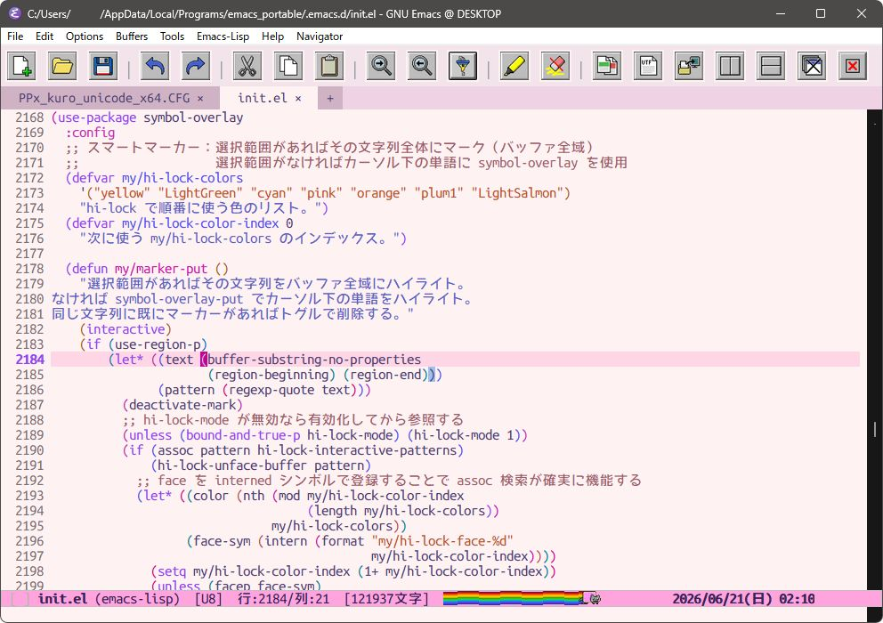

# emacs-windows-native-gui

秀丸・サクラエディタ・EmEditor・Mery のような Windows ネイティブ GUI エディタの操作感で Emacs を使うための個人設定ファイルです。
日本語環境・ポータブル運用を前提に、テキスト編集・個人メモ管理・AI 連携を中心に構成しています。

> **設計思想**: 一般的な Emacs カスタマイズとは異なり、**GUI・マウス併用の Windows エディタらしさ**を追求しています。
> メニューバー・ツールバー・タブバー・右クリックメニューをフル活用し、CUA キーバインド（`C-c/C-v/C-z`）で
> Windows ネイティブアプリに近い操作感を実現しています。「Emacs をエディタとして使う」ことを重視しており、
> キーボード完結よりもマウスとの併用を前提としたワークフローに最適化されています。



## 特徴

- **ポータブル設計** — `user-emacs-directory` を `init.el` の場所から動的に解決するため、USB やフォルダごと移動しても動作します
- **ダッシュボード（emacs-dashboard）** — 起動時に最近開いたファイルやブックマーク、プロジェクト一覧を綺麗にまとめた、カスタムバナー画像付きのホーム画面を表示します
- **CUA モード前提** — `C-c / C-x / C-v / C-z` を Windows 標準のコピー・切り取り・貼り付け・アンドゥに割り当てつつ、Emacs 標準の `C-x` プレフィックスと共存させています
- **GUI フル活用** — メニューバー・ツールバー（カスタムアイコン）・タブバー・右クリックメニュー（EmEditor 風）をすべて有効化
- **日本語対応** — Migemo によるローマ字検索、cp932 ファイルパス対応、mozc-modeless によるモードレス日本語入力を含みます
- **タブバー（Centaur Tabs）** — 内部バッファ（`*scratch*` など）はタブバー上で後方に配置されますが、`F2`（consult-buffer）でいつでも一覧から選択・切り替えできます
- **全角スペース・TAB・行末スペースの可視化** — 全角スペースを「`□`」、TABを「`»`」、行末の不要なスペース（半角・全角）を赤くハイライト表示して、入力・編集ミスを防ぎます
- **サクラエディタ風の正規表現キーワード強調** — テキストや Markdown 文書において、各種括弧（`「」` `【】` `（）` など）、引用符（`''` `""`）、および丸数字（`①-⑳`）を自動で色分け表示します
- **リアルタイム置換（visual-replace）** — 文字入力と同時に、バッファ上で実際に置換された状態がリアルタイムでプレビューされ、置換ミスを未然に防ぎます

## 主な構成

| セクション | 内容 |
|---|---|
| 1. 起動・基本動作 | ダッシュボード画面（emacs-dashboard）、スプラッシュ画面、文字コード、バックアップ設定 |
| 3. 外観 | ef-themes、フォント（Utatane など）、ツールバーアイコン（Silk Icons） |
| 4. 表示・スクロール | 行番号、スクロール挙動、全角スペース・TAB・行末スペース・正規表現キーワードの可視化 |
| 5. モードライン | カスタムレイアウト、パスホバー表示 |
| 6. タブバー | Centaur Tabs によるバッファタブ |
| 8. キーバインド | CUA 互換、F キー割り当て、`M-o` Hydra ランチャー |
| 11. 補完エコシステム | Vertico + Orderless + Consult + Migemo + Embark |
| 12. multiple-cursors | マルチカーソル編集（`C->` / `C-<`） |
| 13. howm | Obsidian 互換 Markdown メモ（howm-markdown.el）、`#タグ` ボタン、consult-ripgrep 連携 |
| 14. Obsidian 連携 | obsidian.el によるノート検索・保存 |
| 19. リアルタイム置換 | visual-replace によるリアルタイムプレビュー付き置換（通常/正規表現） |
| 21b. Mozc 日本語入力 | mozc-modeless によるモードレス日本語入力、`C-\\` で手動 ON/OFF トグル（tr-ime / w32-ime は無効） |
| 22. gptel | OpenAI / xAI / Gemini / OpenRouter 対応 LLM チャット |
| 23. GhostText 連携 | atomic-chrome によるブラウザ入力欄のリアルタイム編集 |

その他：calfw（カレンダー）、Casual（Transient メニュー）、symbol-overlay（カラーマーカー）、Lookup（EPWING 辞書）、nov.el（EPUB）、empv（音楽再生）、zoxide 連携、fd / ripgrep 連携、visual-replace（リアルタイム置換）

## キーバインド早見表

詳細版は **[cheatsheet.md](cheatsheet.md)** を参照してください。

| キー | 動作 |
|---|---|
| `Home` | ダッシュボードの表示 / 再描画（ダッシュボード上では閉じて元のバッファに戻る） |
| `M-o` | Hydra ランチャー（各種サブメニュー） |
| `F4` | アウトラインサイドバー開閉（imenu-list） |
| `F5` | howm 環境トグル（ON: howm-menu を開く / OFF: 全バッファを閉じる） |
| `C-\\` | mozc（日本語入力）ON / OFF トグル |
| `C->` | 次の同じ単語にカーソル追加（multiple-cursors） |
| `C-<` | 前の同じ単語にカーソル追加（multiple-cursors） |
| `C-c m a` | バッファ内の全同一単語にカーソル追加 |
| `C-c m l` | 選択範囲の各行にカーソル追加 |
| `Alt + ドラッグ` | 矩形選択（`rectangle-mark-mode`）を開始 |
| `C-RET` (Ctrl+Enter) | キーボードによる矩形選択を開始 |
| `ESC` | 矩形選択（または選択範囲）の解除 |
| `C-e` | 行頭・行末のスマートトグル（インデント先頭 ⇆ 本当の行頭 ⇆ 行末） |
| `M-%` | リアルタイム通常置換（visual-replace） |
| `C-M-%` | リアルタイム正規表現置換（visual-replace） |

### ダッシュボードでのショートカット

ダッシュボード表示中（`*dashboard*` バッファ）は、キーを一回押すだけで以下の主要機能へ素早くアクセスできます。

| キー | 動作 |
|---|---|
| `Home` | ダッシュボードを閉じて直前のバッファに戻る |
| `o` | メインメニュー（Hydra ランチャー） |
| `e` | Everything で PC 内検索 |
| `s` | プロジェクト内全文検索（ripgrep） |
| `g` | プロジェクト内ファイル名検索（fd） |
| `f` | 最近使ったファイルを開く |
| `c` | cmd.exe（ConPTY ターミナル） |
| `p` | PowerShell（ConPTY ターミナル） |
| `L` | カレンダー（calfw） |
| `d` | 辞書（Lookup） |
| `w` | ウィンドウ操作サブメニュー |
| `F` | ファイル操作サブメニュー |

### ツールバーの機能割り当て

マウス操作を補助するために、ツールバーには以下のカスタム機能（アイコン）が割り当てられています。

| アイコン名 | 割り当て機能 | 関数 | 説明 |
|---|---|---|---|
| `tb-new.png` | 新規ファイル | `find-file` | 新規ファイルを作成して開く |
| `tb-open.png` | ファイルを開く | `menu-find-file-existing` | ダイアログ等を使って既存のファイルを開く |
| `tb-save.png` | 上書き保存 | `save-buffer` | 現在のバッファを保存する |
| `tb-undo.png` | 元に戻す | `undo` | 直前の操作を取り消す |
| `tb-redo.png` | やり直す | `undo-redo` | 取り消した操作をやり直す |
| `tb-cut.png` | 切り取り | `kill-region` | 選択範囲をカットしてキルリングに保存 |
| `tb-copy.png` | コピー | `kill-ring-save` | 選択範囲をコピーしてキルリングに保存 |
| `tb-paste.png` | 貼り付け | `yank` | キルリングから内容を貼り付け |
| `tb-search-fwd.png` | 後を検索 | `isearch-forward` | 現在地より後方（下）に向かってインクリメンタル検索 |
| `tb-search-bwd.png` | 前を検索 | `isearch-backward` | 現在地より前方（上）に向かってインクリメンタル検索 |
| `tb-replace.png` | 置換 | `my/visual-replace-menu` | 通常/正規表現、全体/カーソル以下の置換オプションを選択するポップアップメニューを表示 |
| `tb-filter.png` | フィルタ表示 | `my/emeditor-filter` | 検索条件にマッチする行のみを抽出し、その場で直接編集（内部で `occur-edit-mode` を使用。`C-c C-c` で適用保存） |
| `tb-marker.png` | マーカー設置 | `my/marker-put` | カーソル位置の単語や選択範囲にカラーマーカーを付与／消去 |
| `tb-marker-clear.png` | マーカークリア | `my/marker-remove-all` | バッファ内のすべてのカラーマーカーを一括消去 |
| `tb-diff.png` | 差分比較 | `my-compare-with-winmerge` | 現在のバッファの内容を WinMerge でファイル・差分比較 |
| `tb-encoding.png` | エンコード変更 | `revert-buffer-with-coding-system` | 文字コードを指定してファイルを読み直す |
| `tb-open-ext.png` | 外部アプリ連携 | `my-open-current-file-in-windows` | 開いているファイルを Windows の関連付けプログラムで開く |
| `tb-split-horiz.png` | 左右に分割 | `split-window-right` | ウィンドウを左右に2分割する |
| `tb-split-vert.png` | 上下に分割 | `split-window-below` | ウィンドウを上下に2分割する |
| `tb-close.png` | ウィンドウ閉じる | `delete-window` | 現在アクティブなウィンドウ（分割画面）を閉じる |
| `tb-close-others.png` | 他ウィンドウ閉じる | `delete-other-windows` | 他の分割ウィンドウをすべて閉じて1画面に戻す |

## ディレクトリ構造

ポータブル運用を想定した配置例です。`emacs/` フォルダごと移動・コピーすれば動作します。

```
任意のフォルダ/
├── emacs/                   ← Emacs 本体（runemacs.exe など）
│   └── bin/
│       └── runemacs.exe
├── .emacs.d/                ← この設定リポジトリ
│   ├── init.el              ← メイン設定ファイル
│   ├── custom.el            ← M-x customize の設定（自動生成・公開可）
│   ├── fonts/               ← ポータブルフォント（Utatane など）
│   ├── lisp/                ← ローカル Elisp（conpty.el、howm-markdown.el など）
│   ├── elpa/                ← package.el が管理するパッケージ群（自動生成）
│   ├── frame-geometry.el    ← ウィンドウサイズ・位置の保存（自動生成）
│   └── savehist             ← ミニバッファ履歴（自動生成）
└── bin/                     ← 外部コマンド（PATH がなくてもここから自動検出）
    ├── cmigemo.exe          ← Migemo（日本語ローマ字検索）
    ├── fd.exe               ← ファイル検索
    ├── rg.exe               ← ripgrep（全文検索）
    ├── es.exe               ← Everything CLI（locate 連携）
    └── emacs-conpty.exe     ← Windows ConPTY プロキシ
```

> `bin/` 内の外部コマンドは PATH が通っていれば省略可能です。init.el が PATH → `bin/` の順に自動検出します。

> [!NOTE]
> **Migemo（日本語ローマ字検索）の辞書とDLLについて**:
> - **辞書の配置**: `cmigemo.exe` が置かれている場所から相対的に `dict/utf-8/migemo-dict` となるように辞書ファイルを配置してください（例: `bin/dict/utf-8/migemo-dict`）。
> - **DLLについて**: Emacsの `migemo` パッケージは `cmigemo.exe` を外部プロセスとして呼び出して通信するため、**`migemo.dll` や `cmigemo.dll` などの DLL ファイルは不要**です。

### フォントの準備

本設定は、プログラミング用日本語等幅フォント **[Utatane](https://github.com/nv-h/Utatane)** の利用を前提に設計されています。

1. **フォントの入手**: 
   GitHub リポジトリ [https://github.com/nv-h/Utatane](https://github.com/nv-h/Utatane) から、またはご自身でビルドした `Utatane-Regular.ttf` を取得します。
2. **配置先**:
   設定ディレクトリ配下の `.emacs.d/fonts/` フォルダの中に `Utatane-Regular.ttf` を配置してください。
   （※フォントが見つからない場合は、自動的に `MS Gothic` が代替フォントとして適用されます）

## パッケージ一覧

### 補完・検索

| パッケージ | 用途 |
|---|---|
| vertico | 縦型ミニバッファ補完 UI |
| vertico-multiform | コマンドごとの表示方式切り替え |
| vertico-posframe | カーソル近傍ポップアップ表示 |
| orderless | スペース区切りのあいまい補完 |
| consult | 高機能検索コマンド群（ripgrep・fd・locate 連携） |
| embark / embark-consult | 候補への即時アクション |
| marginalia | ミニバッファ候補への注釈表示 |
| corfu | インラインコード補完 |
| cape | corfu 向け補完ソース拡張 |
| migemo | 日本語ローマ字インクリメンタル検索 |
| wgrep | grep 結果バッファを直接編集 |
| fd-dired | fd を使った Dired ファイル検索 |

### メモ・ドキュメント

| パッケージ | 用途 |
|---|---|
| howm | 個人メモ管理（Obsidian 互換 Markdown） |
| obsidian | Obsidian vault との連携 |
| markdown-mode | Markdown 編集・プレビュー |
| markdown-toc | 目次自動生成 |
| imenu-list | アウトラインサイドバー |
| org-download | 画像の drag & drop 貼り付け |
| nov | EPUB リーダー |
| lookup | EPWING 辞書検索 |
| csv-mode | CSV 表示・編集 |

### UI・外観

| パッケージ | 用途 |
|---|---|
| dashboard | 起動時ダッシュボード画面（バナー表示） |
| ef-themes | カラーテーマ集 |
| centaur-tabs | バッファタブバー |
| nyan-mode | モードライン Nyan Cat |
| hide-mode-line | 特定のウィンドウでモードラインを非表示にする |
| hydra | キーバインドメニュー |
| casual / casual-symbol-overlay | Transient ベースのメニュー UI |
| symbol-overlay | カーソル下の単語をカラーハイライト |
| calfw / calfw-howm / calfw-org | カレンダー表示 |
| japanese-holidays | 日本の祝日データ |

### 編集補助

| パッケージ | 用途 |
|---|---|
| multiple-cursors | マルチカーソル編集 |
| bicycle | バッファ折りたたみ操作 |
| rainbow-delimiters | 括弧を深さごとに色分け表示 |
| zoxide | 頻繁に使うディレクトリへの高速移動（`M-o z`） |

### Windows 連携

| パッケージ | 用途 |
|---|---|
| tr-ime | IME 制御（w32-ime 互換）— 現在は `my/use-mozc-modeless = t` のため **無効** |
| mozc / mozc-modeless | モードレス日本語入力（Google 日本語入力連携）— **現在の主体** |
| conpty | Windows ConPTY ターミナル（emacs-conpty） |
| atomic-chrome | GhostText 拡張機能と連携したブラウザ入力欄の編集 |

### AI 連携

| パッケージ | 用途 |
|---|---|
| gptel | LLM チャット（OpenAI / xAI / Gemini / OpenRouter） |

### 全インストールパッケージ一覧 (MELPA)

`init.el` の `package-selected-packages` に登録され、起動時に MELPA から自動インストールされるパッケージの一覧です（一部主要な依存パッケージも併記しています）。

- `acp` — 自動文字入力パターン補完
- `agent-shell` — 対話型シェル拡張
- `atomic-chrome` — GhostText 拡張機能との連携用 WebSocket サーバー
- `autothemer` — テーマ定義用ユーティリティ
- `beacon` — カーソル移動・スクロール時の位置フラッシュエフェクト
- `bicycle` — 見出し折りたたみ（outline-minor-mode 連携）
- `calfw` / `calfw-howm` / `calfw-org` — カレンダー表示・スケジュール統合
- `cape` — 補完バックエンド拡張（capf）
- `casual-symbol-overlay` — transient ベースのカラーマーカーメニュー
- `centaur-tabs` — バッファタブバー表示
- `corfu` — ポップアップ自動補完 UI
- `dashboard` — 起動時ダッシュボード画面（バナー画像対応）
- `ef-themes` — 視認性の高いカラーテーマ集
- `embark` / `embark-consult` — 選択候補への即時アクションランチャー
- `ewal` — テーマ色カラーパレット連携
- `fd-dired` — fd を使用した Dired 検索
- `forest-blue-theme` — カラーテーマ（Forest Blue）
- `gptel` — LLMチャットクライアント（Gemini / OpenAI 等）
- `hide-mode-line` — 不要なウィンドウ（サイドバー等）でモードラインを非表示化
- `imenu-list` — 右サイドバーのアウトライン見出し一覧
- `japanese-holidays` — カレンダー用日本の祝日データ
- `major-mode-hydra` — メジャーモード固有のメニュー定義
- `marginalia` — ミニバッファ補完候補へのメタ情報/注釈表示
- `markdown-mode` / `markdown-toc` — Markdown 編集と目次自動生成
- `migemo` — 日本語ローマ字でのバッファ内高速検索
- `mozc` / `mozc-modeless` — モードレス日本語入力環境
- `multiple-cursors` — 複数箇所同時編集（マルチカーソル）
- `nov` — EPUB 電子書籍リーダー
- `nyan-mode` — モードラインの Nyan Cat 進行度バー
- `obsidian` — Obsidian Vault との連携
- `orderless` — スペース区切りのあいまいマッチ補完
- `org-download` — ドラッグ＆ドロップによる画像保存・Markdown挿入
- `persist` — 変数の状態永続化
- `persistent-scratch` — scratchバッファ内容の保存と自動復元
- `rainbow-delimiters` — 括弧・ブラケットを深さごとに色分け表示
- `tr-ime` — Windows IME 制御連携（w32-ime 互換）
- `track-changes` — バッファ変更トラッキング
- `vertico` / `vertico-posframe` — 縦型ミニバッファ補完とフレーム内ポップアップ化
- `visual-regexp` — 正規表現を用いたインタラクティブ置換 UI
- `vscode-dark-plus-theme` — VS Code 風ダークテーマ
- `wgrep` — grep / ripgrep 結果バッファの直接編集機能
- `zoxide` — ディレクトリ履歴ベースの高速移動

### オリジナル実装

パッケージに依存せず init.el に直接実装した機能です。

| 関数 | 用途 |
|---|---|
| my/m3u8-search-and-play | m3u/m3u8 プレイリストを consult で検索して外部プレイヤーで再生 |
| my/emeditor-filter | EmEditorのフィルタ風：検索ワードにマッチした行だけを表示し、直接編集・一括保存 |
| my/wgrep-replace | ripgrepで複数ファイルを検索し、結果を直接編集して一括保存 |
| my/ctx-add-quote | 選択範囲または現在行の行頭に引用記号（`> `）を挿入（右クリックメニュー連携） |
| my/ctx-remove-quote | 選択範囲または現在行の行頭の引用記号（`>`）を削除（右クリックメニュー連携） |
| my/howm-toggle | F5 で howm 環境を ON/OFF トグル |
| my/consult-ripgrep-project | プロジェクトルートから ripgrep 検索 |
| my/consult-ripgrep-word | カーソル下の単語で ripgrep 検索 |
| my/consult-line-migemo | Migemo でバッファ内インクリメンタル検索 |
| my/consult-line-symbol-at-point | カーソル下の単語をポップアップ検索 |
| my/obsidian-ripgrep-migemo | Obsidian vault を Migemo で全文検索 |
| my/document-text-view | xdoc2txt / Pandoc でバイナリ文書をテキスト表示 |
| my/nov-open-epub | EPUB ファイルを nov.el で開く |
| my/run-agy-cmd-on-current-file | 現在のファイルを Google Antigravity(agy.exe) に渡し、cmd 外部窓で実行 |
| my/run-agy-powershell-on-current-file | 現在のファイルを Google Antigravity(agy.exe) に渡し、PowerShell 外部窓で実行 |
| my/run-command-cmd-on-current-file | 現在のファイルを引数にして、cmd 外部窓でコマンドを実行（%f=パス） |
| my/run-command-powershell-on-current-file | 現在のファイルを引数にして、PowerShell 外部窓でコマンドを実行（%f=パス） |

### 外部コマンド実行（現在ファイルを対象）

開いているファイルに対して、外部のコンソールプログラム（例: `agy.exe` や `python.exe`）を別ウィンドウのターミナルで実行する機能です。
メインメニューから `M-o F` (ファイル操作) を開き、そこから実行できます。

* **自動保存**: 実行時にバッファに変更がある場合は、自動的に上書き保存を行ってから実行します。
* **カレントディレクトリの追従**: 起動するターミナルは、常に現在開いているファイルのディレクトリ（フォルダ）をカレントディレクトリとして開きます。
* **利用可能なシェル**: `cmd.exe` と `PowerShell` にそれぞれ対応しており、専用のキーバインドが用意されています。
* **ターミナルウィンドウの自動選択**: `wt.exe`（Windows Terminal）がシステムに存在する場合は自動的に Windows Terminal の新しいタブ／ウィンドウとして起動し、ない場合は標準のコンソール（ConHost）ウィンドウで起動します。

#### キーバインド一覧

| キー | 関数 | 説明 |
|---|---|---|
| `M-o F a` | `my/run-agy-cmd-on-current-file` | `agy` に現在のファイルを渡し、`cmd` 窓で実行します。引数を指定可能です。 |
| `M-o F A` | `my/run-agy-powershell-on-current-file` | `agy` に現在のファイルを渡し、`PowerShell` 窓で実行します。引数を指定可能です。 |
| `M-o F x` | `my/run-command-cmd-on-current-file` | 任意の外部コマンドを `cmd` 窓で実行します。入力時に `%f` と書くとファイルパスに置き換わります（ない場合は末尾に追加）。 |
| `M-o F X` | `my/run-command-powershell-on-current-file` | 任意の外部コマンドを `PowerShell` 窓で実行します。入力時に `%f` と書くとファイルパスに置き換わります（ない場合は末尾に追加）。 |

## 動作環境

- Windows 10 / 11
- GNU Emacs 29 以上
- 外部コマンド：`fd`、`rg`（ripgrep）、`perl`、`es.exe`（Everything）を PATH または `bin/` フォルダに配置

## 注意

### `custom.el` について

`M-x customize` でテーマや設定を変更すると、`custom-set-variables` / `custom-set-faces` が **`custom.el`** に自動書き込みされます。
`init.el` 自体には書き込まれないため、設定ファイルが汚染されません。

- **`custom.el` は公開しても安全**です。含まれるのはテーマ名・UI の ON/OFF などのみで、パスワードや個人情報は一切含まれません。
- 新しい環境に持ち込んだ際、`custom.el` が存在しなくても問題なく起動します（テーマ等はデフォルト値が使われます）。
- `init.el` の先頭付近で `(setq custom-file ...)` と `(load custom-file ...)` を設定しているため、起動時に自動で読み込まれます。

## メンテナンスとカスタマイズについて

本リポジトリの設定（`init.el`）の構築、チートシートの作成、アセット選定、および機能追加・ツールバーアイコン作成などのカスタマイズは、AI アシスタント（Claude 3.5 Sonnet / Gemini 1.5/3.5 Flash 等）との共同開発によって行われています。

Emacs の Lisp（Elisp）による設定やカスタマイズは、パッケージ同士の競合や構文のミスによりトラブルが発生しやすく、自力でのデバッグは難易度が高い場合があります。そのため、本設定の拡張やメンテナンスを行う際も、同様に AI アシスタントに設定ファイル（`init.el`）と要望を渡し、カスタマイズを任せることを強く推奨します。競合を避けた安全なコード生成やデバッグを自動で行ってくれるため、手動で編集するよりも圧倒的にメンテナンスしやすくなります。

## クレジットとライセンス

### コードのライセンス
本リポジトリの各種 Elisp 設定コードは [MIT License](LICENSE) のもとで公開されています。

### アセットのライセンス
ツールバー等で使用しているアイコンアセットの著作権・ライセンスは各作者に帰属します。
* **Silk Icons** (by [famfamfam](http://www.famfamfam.com/lab/icons/silk/)): [CC BY 2.5](https://creativecommons.org/licenses/by/2.5/)
* **Adwaita Icons** (by [GNOME Project](https://gitlab.gnome.org/GNOME/adwaita-icon-theme)): [CC BY-SA 3.0](https://creativecommons.org/licenses/by-sa/3.0/) / GNU LGPL v3
